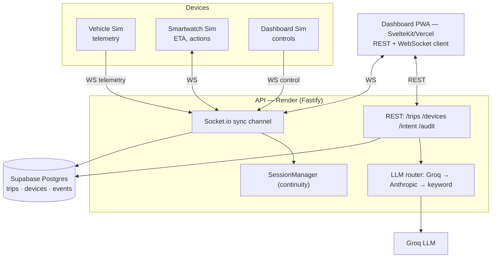

# Architecture

Orakon Trip keeps a single trip's state coherent across a car, a smartwatch, and a laptop. The design splits cleanly along two transports: **REST for CRUD**, **WebSocket for realtime**.

```
            ┌──────────────────────── Devices ────────────────────────┐
            │   car (vehicle)      smartwatch        laptop/dashboard  │
            └─────────┬───────────────┬───────────────────┬───────────┘
        telemetry / control (WS)      │ ETA, actions       │ map, controls
                      ▼               ▼                    ▼
            ┌───────────────────────────────────────────────────────────┐
            │                       API (Fastify)                        │
            │   REST: /trips /devices /intent /audit                     │
            │   Socket.io sync channel  ◄── shares the same HTTP server  │
            └───────────────┬──────────────────────────┬────────────────┘
                            │                           │
                   ┌────────▼─────────┐        ┌────────▼─────────┐
                   │  Agent core      │        │  LLM intent      │
                   │  • SessionManager│        │  Claude (Haiku)  │
                   │  • TripStore     │        │  forced tool-use │
                   │  • SyncChannel   │        │  → {action}      │
                   └────────┬─────────┘        └──────────────────┘
                            │
                  ┌─────────▼──────────┐
                  │ Store (TripStore)  │
                  │ Postgres │ memory  │  ← events table = immutable audit log
                  └────────────────────┘
```

## Component responsibilities



| Component | Responsibility |
| --- | --- |
| **Dashboard PWA** | UI (map, create-trip form, controls) · REST + WebSocket client |
| **API (Render)** | REST + WebSocket broker · LLM router · cross-device continuity (SessionManager) |
| **Supabase DB** | `trips` (persist), `devices`, `events` (append-only audit log) |
| **Groq LLM** | intent classification (NL → action) |
| **Vehicle Sim** | telemetry emitter (gps / battery / speed) |
| **Smartwatch Sim** | ETA display + actions (accept/dismiss, request charger) |
| **Dashboard Sim** | sends `pause` / `resume` / `redirect` controls |

## Components

### `agents/` — agent core (shared library)
- **`TripStore`** (`store.ts`) — interface over trip/device/event persistence. `createStore()` returns `PostgresStore` when `DATABASE_URL` is set, otherwise `InMemoryStore`. Postgres is imported lazily, so the `pg` driver never loads in the in-memory path. The `events` table/collection is **append-only** — the immutable audit log.
- **`SessionManager`** (`sessionManager.ts`) — tracks which devices are connected to which trip, plus the **last known telemetry and status per trip**. This is the heart of continuity: a device that joins mid-trip is handed the current snapshot rather than a blank slate.
- **`attachSyncChannel`** (`syncChannel.ts`) — wires the realtime protocol onto a Socket.io server: join → snapshot, telemetry fan-out, control → state broadcast, and event logging on every mutation.

### `api/` — Fastify server
- REST routes (`routes.ts`) for CRUD + intent + audit. Every state mutation also (a) appends to the audit log and (b) broadcasts to the trip's Socket.io room, so REST and WS stay consistent.
- Socket.io attaches to the **same HTTP server** Fastify creates (`app.server`), so one port serves both REST and WS.
- `llm/intent.ts` classifies free text into `route | pause | charger` via a **provider router**: **Groq** (OpenAI-compatible, JSON mode) → **Anthropic** (Claude, forced tool-use) → deterministic **keyword** fallback. It degrades gracefully and never blocks the endpoint; `/health` reports the active `intent.provider`.

### `device-sim/` — simulators
Three Node processes that exercise the system as real devices would:
- **vehicle** — registers as `car`, drives the route, emits `telemetry` (gps/battery/speed) on a timer, and obeys `trip:state` (stops moving when paused).
- **smartwatch** — registers as `watch`, computes ETA from telemetry, auto-accepts suggestions, and asks for a charger via `/intent`.
- **dashboard** — registers as `laptop`, observes everything, and can issue a `trip:control` from the CLI.

### `dashboard/` — SvelteKit PWA
SPA (client-rendered) with a Leaflet map, live trip card (state/ETA/battery/speed), control buttons, connected-device chips, and an activity feed. Installable PWA via `manifest.webmanifest` + a cache-first `service-worker.ts`.

## How continuity works

1. The vehicle creates/joins a trip and starts streaming `telemetry`. The `SessionManager` records the latest telemetry and status keyed by `tripId`.
2. When the watch (or laptop) connects and emits `trip:join`, the server replies with `trip:snapshot` — current trip + latest telemetry + connected devices. The new device is immediately in sync; nothing restarts.
3. Any device issues `trip:control` (or `PUT /trips/:id`). The store updates, an event is appended, and `trip:state` broadcasts to **every** device in the trip room.
4. Natural-language requests hit `POST /intent` → Claude (or fallback) → `{action}`. If a `tripId` is supplied, the suggestion is logged and pushed to the room as `intent:suggestion`.

Because every mutation flows through the store (audit) **and** the room (sync), the live view and the historical log never diverge — replaying `/audit?tripId=` reconstructs the whole trip.

## Data model

- **trips** — `id, start, end, route[], batteryEst, status, timestamps`
- **devices** — `id, type (car|watch|laptop), capabilities[], registeredAt`
- **events** — `id, tripId, type, deviceId?, payload, ts` — append-only audit/event log; indexed by `(trip_id, ts)`

## Design choices & trade-offs

- **REST + WS split** keeps CRUD idempotent and cacheable while realtime stays event-driven on one port.
- **Store interface with two implementations** makes the MVP runnable with zero infra, and Supabase-ready by setting one env var — no code change.
- **Forced tool-use for intent** gives schema-guaranteed output on a fast/cheap model (Haiku), and the keyword fallback keeps `/intent` and the test suite hermetic.
- **`tsx` everywhere** — run TypeScript directly, no build step required to develop or demo. A `build` script is provided for later.

## Extension points

- Promote `trip:control` to per-action tools with permissioning.
- Add Supabase Row-Level Security and auth (devices → users).
- Replace simulated telemetry with a real OBD/GPS source.
- Push `intent:suggestion` to the watch as actionable cards with accept/dismiss round-trips (the `device:action` event already exists).
