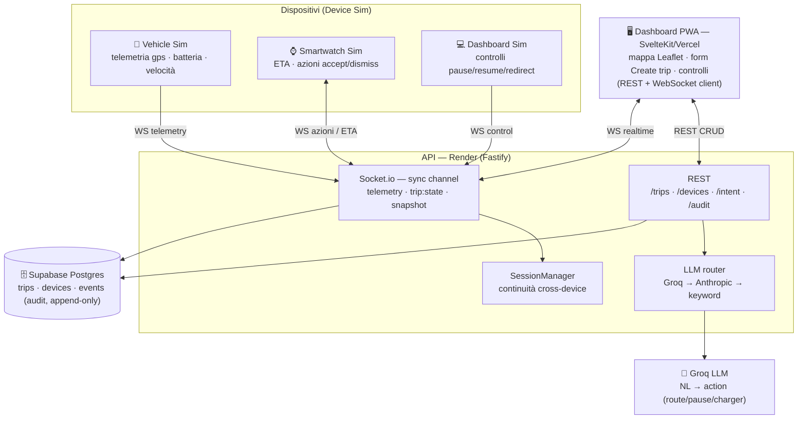

# Orakon Trip — Diagramma architetturale

> Continuità di viaggio cross-device (auto → smartwatch → laptop) con stato condiviso in tempo reale.
> Live: dashboard https://orakon-trip-dashboard.vercel.app · API https://orakon-trip-api.onrender.com

## Vista d'insieme (componenti + connessioni)

## Componenti e responsabilità

| Componente | Responsabilità |
| --- | --- |
| **Dashboard PWA** | UI (mappa, form Create trip, controlli) · REST client · WebSocket client |
| **API (Render)** | Broker REST + WebSocket · LLM router · continuità (SessionManager) |
| **Supabase DB** | `trips` (persistenza), `devices`, `events` (audit log append-only) |
| **Groq LLM** | Classificazione intent (linguaggio naturale → azione) |
| **Vehicle Sim** | Emette telemetria (gps, batteria, velocità) |
| **Smartwatch Sim** | Mostra ETA, esegue azioni (accept/dismiss), può chiedere un charger |
| **Dashboard Sim** | Invia comandi `pause/resume/redirect` |

## Connettività

| Canale | Tecnologia | Uso |
| --- | --- | --- |
| **REST** | HTTPS (Fastify) | CRUD: crea/leggi/aggiorna trip, registra device, intent, audit |
| **WebSocket** | Socket.io | Realtime: telemetria, cambi di stato, snapshot di join |
| **DB** | Postgres (pg, Session pooler IPv4) | Persistenza + audit append-only |
| **LLM** | HTTPS (OpenAI-compatible) | Intent classification via Groq |

## Stack tecnico

- **Frontend**: SvelteKit 2 + Svelte 5 (PWA, service worker), Leaflet, socket.io-client → Vercel
- **Backend**: Node 22, Fastify 5, Socket.io 4, `pg`, `@anthropic-ai/sdk` → Render
- **DB**: Supabase Postgres
- **LLM**: Groq (`llama-3.3-70b-versatile`), fallback Anthropic, fallback keyword
- **Lingua**: TypeScript strict (ESM), eseguito con `tsx`
- **CI/CD**: GitHub `Vidu78/orakon-trip` → auto-deploy Vercel (dashboard) + Render (API); GitHub Action keep-alive

## Componenti interni dell'API

| Modulo | File | Ruolo |
| --- | --- | --- |
| Routes | `api/src/routes.ts` | Endpoint REST + logging audit + broadcast |
| Server | `api/src/server.ts` | Fastify + Socket.io sullo stesso HTTP server |
| LLM router | `api/src/llm/intent.ts` | Groq → Anthropic → keyword fallback |
| Trip store | `agents/src/store.ts` | Interfaccia + factory (Postgres / in-memory) |
| SessionManager | `agents/src/sessionManager.ts` | Ultimo stato/telemetria per trip → continuità |
| Sync channel | `agents/src/syncChannel.ts` | Protocollo Socket.io (join/telemetry/control) |

## Deployment

| Servizio | Host | Trigger | Note |
| --- | --- | --- | --- |
| Dashboard | Vercel | push su `main` (rootDir `dashboard`) | PWA statica (adapter-static) |
| API | Render | push su `main` (Blueprint `render.yaml`) | Web service, WebSocket, free tier |
| DB | Supabase | — | schema creato in automatico all'avvio |
| Keep-alive | GitHub Actions | cron `*/10 * * * *` | ping `/health` per evitare lo sleep |

## Error handling (sintesi)

- **DB assente** (`DATABASE_URL` non settato) → store **in-memory** (degrado, niente crash).
- **LLM giù / senza key** → fallback Anthropic → **classificatore keyword** (l'intent risponde sempre).
- **WebSocket drop** → socket.io-client riconnette in automatico; al re-join arriva lo **snapshot** (continuità).
- **Cold start Render** → primo accesso lento; i simulatori hanno **warm-up + retry**.

Dettaglio completo in [`flusso-errore-orakon-trip.md`](flusso-errore-orakon-trip.md).
