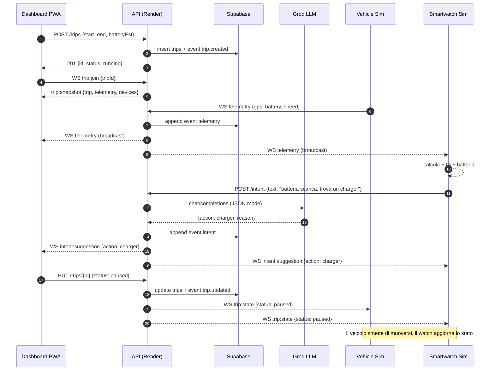
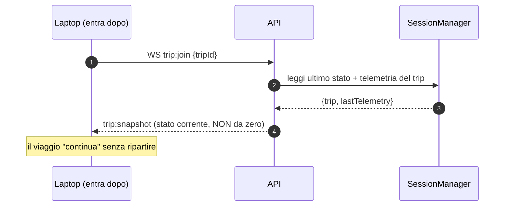

# Orakon Trip — Diagramma sequenziale

Flusso end-to-end di un viaggio con continuità cross-device e intent LLM.

## Scenario: avvio viaggio → telemetria → richiesta charger → handoff

## Continuità (un device entra a viaggio in corso)

